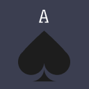
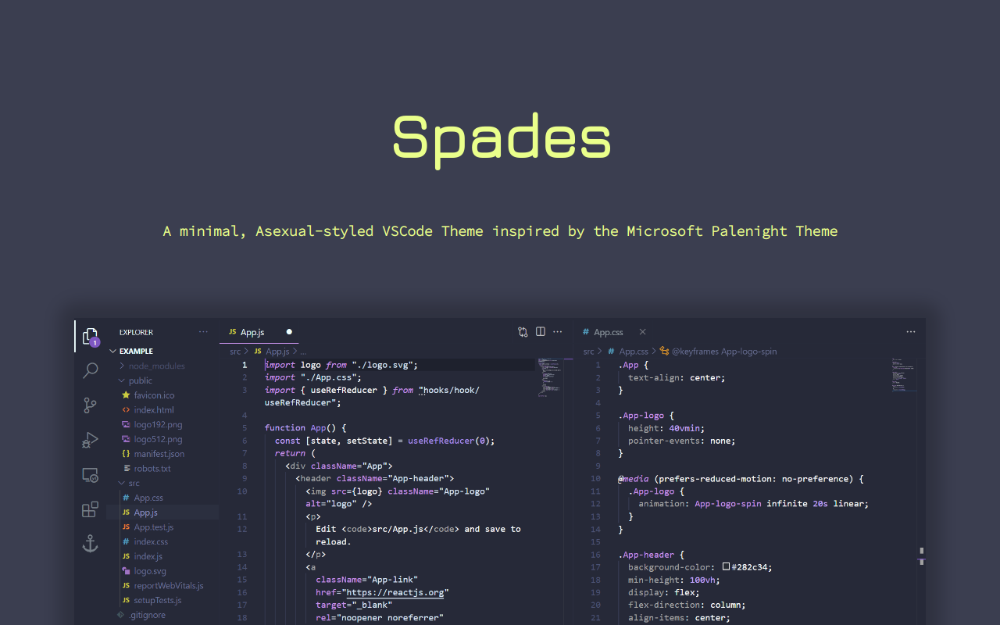

<h1 align="center"><i>Spades</i></h1>

A minimal, Asexual-Styled VS Code Theme inspired by the Microsoft Palenight Theme

## About

_Spades_ is an Asexual-Styled VSCode theme developed and brought to you by an Asexual. See [Collaborators](#collaborators). This theme is inspired by the Microsoft Palenight theme, having a similar look and feel.

## Installation via VS Code

1. Open **Extensions** sidebar panel in VS Code. `View → Extensions`
2. Search for `Spades`
3. Click **Install** to install it
4. Click **Reload** to reload the editor
5. Code > Preferences > Color Theme > **Spades**

## Manual Installation

Read the [VSC Extension Quickstart Guide](https://github.com/Red-CS/Spades/vsc-extension-quickstart.md)

## Supported Languages

- Javascript (.js, .jsx)
- Typescript (.ts, .tsx)
- HTML
- CSS
- JSON

### Languages to be Implemented

- Java
- Python
- C
- C++
- C#
- SCSS
- SASS

## Collaborators

- [Red Williams (Red-CS)](https://www.github.com/Red-CS)

## Contribution

Contribution on this theme is highly encouraged! To learn how to contribute, see [CONTRIBUTING.md](CONTRIBUTING.md)

**Enjoy!🖤🤍💜**
